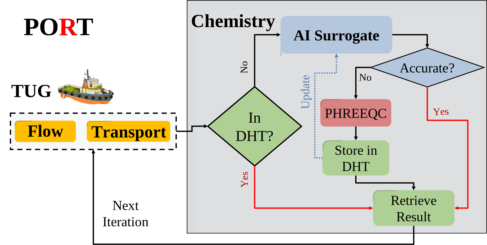

<!--
    Time-stamp: "Last modified 2023-01-19 12:06:10 delucia"
-->

# POET

[POET](https://doi.org/10.5281/zenodo.4757913) is a coupled reactive transport
simulator implementing a parallel architecture and a fast, original MPI-based
Distributed Hash Table.



## Parsed code documentiation

A parsed version of POET's documentiation can be found at [Gitlab
pages](https://naaice.git-pages.gfz-potsdam.de/poet).

## External Libraries

The following external header library is shipped with POET:

- **argh** - https://github.com/adishavit/argh (BSD license)
- **PhreeqcRM** with patches from GFZ -
  https://www.usgs.gov/software/phreeqc-version-3 -
  https://git.gfz-potsdam.de/mluebke/phreeqcrm-gfz
- **tug** - https://git.gfz-potsdam.de/sec34/tug

## Installation

### Requirements

To compile POET you need several software to be installed:

- C/C++ compiler (tested with GCC)
- MPI-Implementation (tested with OpenMPI and MVAPICH)
- R language and environment
- CMake 3.9+
- *optional*: `doxygen` with `dot` bindings for documentiation

The following R libraries must then be installed, which will get the
needed dependencies automatically:

- [Rcpp](https://cran.r-project.org/web/packages/Rcpp/index.html)
- [RInside](https://cran.r-project.org/web/packages/RInside/index.html)

### Compiling source code

The generation of makefiles is done with CMake. You should be able to generate
Makefiles by running:

```sh
mkdir build && cd build
cmake ..
```

This will create the directory `build` and processes the CMake files
and generate Makefiles from it. You're now able to run `make` to start
build process.

If everything went well you'll find the executable at
`build/app/poet`, but it is recommended to install the POET project
structure to a desired `CMAKE_INSTALL_PREFIX` with `make install`.

During the generation of Makefiles, various options can be specified
via `cmake -D <option>=<value> [...]`. Currently, there are the
following available options:

- **POET_DHT_Debug**=_boolean_ - toggles the output of detailed statistics about
  DHT usage. Defaults to _OFF_.
- **POET_ENABLE_TESTING**=_boolean_ - enables small set of unit tests (more to
  come). Defaults to _OFF_.
- **POET_USE_PRM_BACKEND**=_bollean_ - use the PhreeqcRM parallelization instead
  of POET's one. Intended for debugging purposes for modellers.
  
### Example: Build from scratch

Assuming that only the C/C++ compiler, MPI libraries, R runtime
environment and CMake have been installed, POET can be installed as
follows:

```sh
# start R environment
$ R

# install R dependencies
> install.packages(c("Rcpp", "RInside"))
> q(save="no")

# cd into POET project root
$ cd <POET_dir>

# Build process
$ mkdir build && cd build
$ cmake -DCMAKE_INSTALL_PREFIX=/home/<user>/poet ..
$ make -j<max_numprocs>
$ make install
```

This will install a POET project structure into `/home/<user>/poet`
which is called hereinafter `<POET_INSTALL_DIR>`. With this version of
POET we **do not recommend** to install to hierarchies like
`/usr/local/` etc.

The correspondending directory tree would look like this:

```sh
poet
├── bin
│   └── poet
├── R_lib
│   └── kin_r_library.R
└── share
    └── poet
        ├── bench
        │   ├── dolo_diffu_inner_large.R
        │   ├── dolo_diffu_inner.R
        │   └── dolo_inner.pqi
        └── examples
            ├── dol.pqi
            ├── phreeqc_kin.dat
            ├── SimDol1D_diffu.R
            └── SimDol2D_diffu.R
```

The R libraries will be loaded at runtime and the paths are hardcoded
absolute paths inside `poet.cpp`. So, if you consider to move
`bin/poet` either change paths of the R source files and recompile
POET or also move `R_lib/*` relative to the binary.

## Running

Run POET by `mpirun ./poet <OPTIONS> <SIMFILE> <OUTPUT_DIRECTORY>`
where:

- **OPTIONS** - runtime parameters (explained below)
- **SIMFILE** - simulation described as R script (e.g.
  `<POET_INSTALL_DIR>/share/examples/SimDol2D_diffu.R`)
- **OUTPUT_DIRECTORY** - path, where all output of POET should be stored

### Runtime options

The following parameters can be set:

| Option                   | Value        | Description                                                                                                              |
|--------------------------|--------------|--------------------------------------------------------------------------------------------------------------------------|
| **--work-package-size=** | _1..n_       | size of work packages (defaults to _5_)                                                                                  |
| **--ignore-result**      |              | disables store of simulation resuls                                                                                      |
| **--dht**                |              | enabling DHT usage (defaults to _OFF_)                                                                                   |
| **--dht-signif=**        | _1..n_       | set rounding to number of significant digits (defaults to _5_) (it is recommended to use `signif_vec` in R input script) |
| **--dht-strategy=**      | _0-1_        | change DHT strategy. **NOT IMPLEMENTED YET** (Defaults to _0_)                                                           |
| **--dht-size=**          | _1-n_        | size of DHT per process involved in megabyte (defaults to _1000 MByte_)                                                  |
| **--dht-snaps=**         | _0-2_        | disable or enable storage of DHT snapshots                                                                               |
| **--dht-file=**          | `<SNAPSHOT>` | initializes DHT with the given snapshot file                                                                             |

#### Additions to `dht-signif`

Only used if no vector is given in setup file. For individual values
per column use R vector `signif_vector` in `SIMFILE`.

#### Additions to `dht-snaps`

Following values can be set:

- _0_ = snapshots are disabled
- _1_ = only stores snapshot at the end of the simulation with name
  `<OUTPUT_DIRECTORY>.dht`
- _2_ = stores snapshot at the end and after each iteration iteration
  snapshot files are stored in `<DIRECTORY>/iter<n>.dht`

### Example: Running from scratch

We will continue the above example and start a simulation with
`SimDol2D_diffu.R`. As transport a simple fixed-coefficient diffusion is used.
It's a 2D, 100x100 grid, simulating 10 time steps. To start the simulation with
4 processes `cd` into your previously installed POET-dir
`<POET_INSTALL_DIR>/bin` and run:

```sh
mpirun -n 4 ./poet ../share/poet/examples/SimDol2D_diffu.R output
```

After a finished simulation all data generated by POET will be found
in the directory `output`.

You might want to use the DHT to cache previously simulated data and reuse them
in further time-steps. Just append `--dht` to the options of POET to activate
the usage of the DHT. Also, after each iteration a DHT snapshot shall be
produced. This is done by appending the `--dht-snaps=<value>` option. The
resulting call would look like this:

```sh
mpirun -n 4 ./poet --dht --dht-snaps=2 ../share/poet/examples/SimDol2D_diffu.R output
```

## About the usage of MPI_Wtime()

Implemented time measurement functions uses `MPI_Wtime()`. Some
important information from the OpenMPI Man Page:

For example, on platforms that support it, the clock_gettime()
function will be used to obtain a monotonic clock value with whatever
precision is supported on that platform (e.g., nanoseconds).
