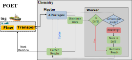

# POET

[POET](https://doi.org/10.5281/zenodo.4757913) is a coupled reactive
transport simulator implementing a parallel architecture and a fast,
original MPI-based Distributed Hash Table.



## Parsed code documentiation

A parsed version of POET's documentation can be found at [Gitlab
pages](https://naaice.git-pages.gfz-potsdam.de/poet).

## External Libraries

The following external libraries are shipped with POET:

- **argh** - https://github.com/adishavit/argh (BSD license)
- **IPhreeqc** with patches from GFZ -
  https://github.com/usgs-coupled/iphreeqc -
  https://git.gfz-potsdam.de/naaice/iphreeqc
- **tug** - https://git.gfz-potsdam.de/naaice/tug

## Installation

### Requirements

To compile POET you need following software to be installed:

- C/C++ compiler (tested with GCC)
- MPI-Implementation (tested with OpenMPI and MVAPICH)
- CMake 3.9+
- Eigen3 3.4+ (required by `tug`)
- *optional*: `doxygen` with `dot` bindings for documentation
- R language and environment (distro dependent)

The following R packages (and their dependencies) must also be
installed:

- [Rcpp](https://cran.r-project.org/web/packages/Rcpp/index.html)
- [RInside](https://cran.r-project.org/web/packages/RInside/index.html)
- [qs](https://cran.r-project.org/web/packages/qs/index.html)

This can be simply achieved by issuing the following commands:

```sh
# start R environment
$ R

# install R dependencies (case sensitive!)
> install.packages(c("Rcpp", "RInside","qs"))
> q(save="no")
```


### Compiling source code

POET is built with CMake. You can generate Makefiles by running the
usual:

```sh
mkdir build && cd build
cmake ..
```

This will create the directory `build` and processes the CMake files
and generate Makefiles from it. You're now able to run `make` to start
build process.

If everything went well you'll find the executables at
`build/src/poet`, but it is recommended to install the POET project
structure to a desired `CMAKE_INSTALL_PREFIX` with `make install`.

During the generation of Makefiles, various options can be specified
via `cmake -D <option>=<value> [...]`. Currently, there are the
following available options:

- **POET_DHT_Debug**=_boolean_ - toggles the output of detailed
  statistics about DHT usage. Defaults to _OFF_.
- **POET_ENABLE_TESTING**=_boolean_ - enables small set of unit tests
  (more to come). Defaults to _OFF_.
- **POET_PHT_ADDITIONAL_INFO**=_boolean_ - enabling the count of
  accesses to one PHT bucket. Use with caution, as things will get
  slowed down significantly. Defaults to _OFF_.
- **POET_PREPROCESS_BENCHS**=*boolean* - enables the preprocessing of
  predefined models/benchmarks. Defaults to *ON*.
  
### Example: Build from scratch

Assuming that only the C/C++ compiler, MPI libraries, R runtime
environment and CMake have been installed, POET can be installed as
follows:

```sh
# start R environment
$ R

# install R dependencies
> install.packages(c("Rcpp", "RInside","qs"))
> q(save="no")

# cd into POET project root
$ cd <POET_dir>

# Build process
$ mkdir build && cd build
$ cmake -DCMAKE_INSTALL_PREFIX=/home/<user>/poet ..
$ make -j<max_numprocs>
$ make install
```

This will install a POET project structure into `/home/<user>/poet`
which is called hereinafter `<POET_INSTALL_DIR>`. With this version of
POET we **do not recommend** to install to hierarchies like
`/usr/local/` etc.

The correspondending directory tree would look like this:

```sh
poet
├── bin
│   ├── poet
│   └── poet_init
└── share
    └── poet
        ├── barite
        │   ├── barite_200.rds
        │   ├── barite_200_rt.R
        │   ├── barite_het.rds
        │   └── barite_het_rt.R
        ├── dolo
        │   ├── dolo_inner_large.rds
        │   ├── dolo_inner_large_rt.R
        │   ├── dolo_interp.rds
        │   └── dolo_interp_rt.R
        └── surfex
            ├── PoetEGU_surfex_500.rds
            └── PoetEGU_surfex_500_rt.R
```

With the installation of POET, two executables are provided: 
  - `poet` - the main executable to run simulations
  - `poet_init` - a preprocessor to generate input files for POET from
    R scripts

Preprocessed benchmarks can be found in the `share/poet` directory
with an according *runtime* setup. More on those files and how to
create them later.

## Running

Run POET by `mpirun ./poet [OPTIONS] <RUNFILE> <SIMFILE>
<OUTPUT_DIRECTORY>` where:

- **OPTIONS** - POET options (explained below)
- **RUNFILE** - Runtime parameters described as R script
- **SIMFILE** - Simulation input prepared by `poet_init`
- **OUTPUT_DIRECTORY** - path, where all output of POET should be
  stored

### POET command line arguments

The following parameters can be set:

| Option                      | Value        | Description                                                                                                              |
|-----------------------------|--------------|--------------------------------------------------------------------------------------------------------------------------|
| **--work-package-size=**    | _1..n_       | size of work packages (defaults to _5_)                                                                                  |
| **-P, --progress**          |              | show progress bar                                                                                                        |
| **--ai-surrogate**          |              | activates the AI surrogate chemistry model (defaults to _OFF_)                                                           |
| **--dht**                   |              | enabling DHT usage (defaults to _OFF_)                                                                                   |
| **--qs**                    |              | store results using qs::qsave() (.qs extension) instead of default RDS (.rds)                                            |
| **--dht-strategy=**         | _0-1_        | change DHT strategy. **NOT IMPLEMENTED YET** (Defaults to _0_)                                                           |
| **--dht-size=**             | _1-n_        | size of DHT per process involved in megabyte (defaults to _1000 MByte_)                                                  |
| **--dht-snaps=**            | _0-2_        | disable or enable storage of DHT snapshots                                                                               |
| **--dht-file=**             | `<SNAPSHOT>` | initializes DHT with the given snapshot file                                                                             |
| **--interp-size**           | _1-n_        | size of PHT (interpolation) per process in megabyte                                                                      |
| **--interp-bucket-entries** | _1-n_        | number of entries to store at maximum in one PHT bucket                                                                  |
| **--interp-min**            | _1-n_        | number of entries in PHT bucket needed to start interpolation                                                            |

#### Additions to `dht-snaps`

Following values can be set:

- _0_ = snapshots are disabled
- _1_ = only stores snapshot at the end of the simulation with name
  `<OUTPUT_DIRECTORY>.dht`
- _2_ = stores snapshot at the end and after each iteration iteration
  snapshot files are stored in `<DIRECTORY>/iter<n>.dht`

### Example: Running from scratch

We will continue the above example and start a simulation with
*barite_het*, which simulation files can be found in
`<INSTALL_DIR>/share/poet/barite/barite_het*`. As transport a
heterogeneous diffusion is used. It's a small 2D grid, 2x5 grid,
simulating 50 time steps with a time step size of 100 seconds. To
start the simulation with 4 processes `cd` into your previously
installed POET-dir `<POET_INSTALL_DIR>/bin` and run:

```sh
cp ../share/poet/barite/barite_het* .
mpirun -n 4 ./poet barite_het_rt.R barite_het.rds output
```

After a finished simulation all data generated by POET will be found
in the directory `output`.

You might want to use the DHT to cache previously simulated data and
reuse them in further time-steps. Just append `--dht` to the options
of POET to activate the usage of the DHT. Also, after each iteration a
DHT snapshot shall be produced. This is done by appending the
`--dht-snaps=<value>` option. The resulting call would look like this:

```sh
mpirun -n 4 ./poet --dht --dht-snaps=2 barite_het_rt.R barite_het.rds output
```

### Example: Preparing Environment and Running with AI surrogate

To run the AI surrogate, you need to install the R package `keras3`. The
compilation process of POET remains the same as shown above.

In the following code block, the installation process on the Turing Cluster is
shown. `miniconda` is used to create a virtual environment to install
tensorflow/keras. Please adapt the installation process to your needs.

<!-- Start an R interactive session and install the required packages: -->

```sh
# First, install the required R packages
R -e "install.packages('keras3', repos='https://cloud.r-project.org/')"

# manually create a virtual environment to install keras/python using conda, 
# as this is somehow broken on the Turing Cluster when using the `keras::install_keras()` function
cd poet

# create a virtual environment in the .ai directory with python 3.11
conda create -p ./.ai python=3.11
conda activate ./.ai

# install tensorflow and keras
pip install keras tensorflow[and-cuda]

# add conda's python path to the R environment
# make sure to have the conda environment activated
echo -e "RETICULATE_PYTHON=$(which python)\n" >> ~/.Renviron
```

After setup the R environment, recompile POET and you're ready to run the AI
surrogate.

```sh
cd <installation_dir>/bin

# copy the benchmark files to the installation directory
cp <project_root_dir>/bench/barite/{barite_50ai*,db_barite.dat,barite.pqi} .

# preprocess the benchmark
./poet_init barite_50ai.R

# run POET with AI surrogate and GPU utilization
srun --gres=gpu -N 1 -n 12 ./poet --ai-surrogate barite_50ai_rt.R barite_50ai.rds output
```

Keep in mind that the AI surrogate is currently not stable or might also not
produce any valid predictions.

## Defining a model

In order to provide a model to POET, you need to setup a R script
which can then be used by `poet_init` to generate the simulation
input. Which parameters are required can be found in the
[Wiki](https://git.gfz-potsdam.de/naaice/poet/-/wikis/Initialization).
We try to keep the document up-to-date. However, if you encounter
missing information or need help, please get in touch with us via the
issue tracker or E-Mail.

`poet_init` can be used as follows:

```sh
./poet_init [-o, --output output_file] [-s, --setwd]  <script.R>
```

where: 

- **output** - name of the output file (defaults to the input file
  name with the extension `.rds`)
- **setwd** - set the working directory to the directory of the input
  file (e.g. to allow relative paths in the input script). However,
  the output file will be stored in the directory from which
  `poet_init` was called.

## About the usage of MPI_Wtime()

Implemented time measurement functions uses `MPI_Wtime()`. Some
important information from the OpenMPI Man Page:

For example, on platforms that support it, the clock_gettime()
function will be used to obtain a monotonic clock value with whatever
precision is supported on that platform (e.g., nanoseconds).

## Additional functions for the AI surrogate

The AI surrogate can be activated for any benchmark and is by default
initiated as a sequential keras model with three hidden layer of depth
48, 96, 24 with relu activation and adam optimizer. All functions in
`ai_surrogate_model.R` can be overridden by adding custom definitions
via an R file in the input script. This is done by adding the path to
this file in the input script. Simply add the path as an element
called `ai_surrogate_input_script` to the `chemistry_setup` list.
Please use the global variable `ai_surrogate_base_path` as a base path
when relative filepaths are used in custom funtions.

**There is currently no default implementation to determine the
validity of predicted values.** This means, that every input script
must include an R source file with a custom function
`validate_predictions(predictors, prediction)`. Examples for custom
functions can be found for the barite_200 benchmark

The functions can be defined as follows:

`validate_predictions(predictors, prediction)`: Returns a boolean
index vector that signals for each row in the predictions if the
values are considered valid. Can eg. be implemented as a mass balance
threshold between the predictors and the prediction.

`initiate_model()`: Returns a keras model. Can be used to load
pretrained models.

`preprocess(df, backtransform = FALSE, outputs = FALSE)`: Returns the
scaled/transformed/backtransformed dataframe. The `backtransform` flag
signals if the current processing step is applied to data that's
assumed to be scaled and expects backtransformed values. The `outputs`
flag signals if the current processing step is applied to the output
or tatget of the model. This can be used to eg. skip these processing
steps and only scale the model input.

`training_step (model, predictor, target, validity)`: Trains the model
after each iteration. `validity` is the bool index vector given by
`validate_predictions` and can eg. be used to only train on values
that have not been valid predictions.
